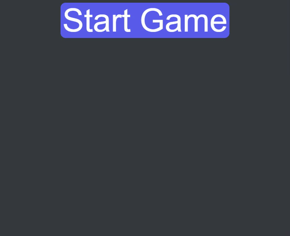

# Word Guess

deployment: https://brandonnorsworthy.github.io/uta-wordguess/

## About

When you click on the start button it generates a random word that you then use keyboard events to guess and fill out the blanks. There is no time limit just was a small programming challenge. This was a coding challenge activity where in 1 hour we had to psuedocode this game.

## Demo



## Functionality

- Restyled to make nicer to look at
- Uses ```keydown``` events on the DOM to read user input
- Only listens to relevant keyboard presses
- Splits a string and replaces each character with a ```_``` character